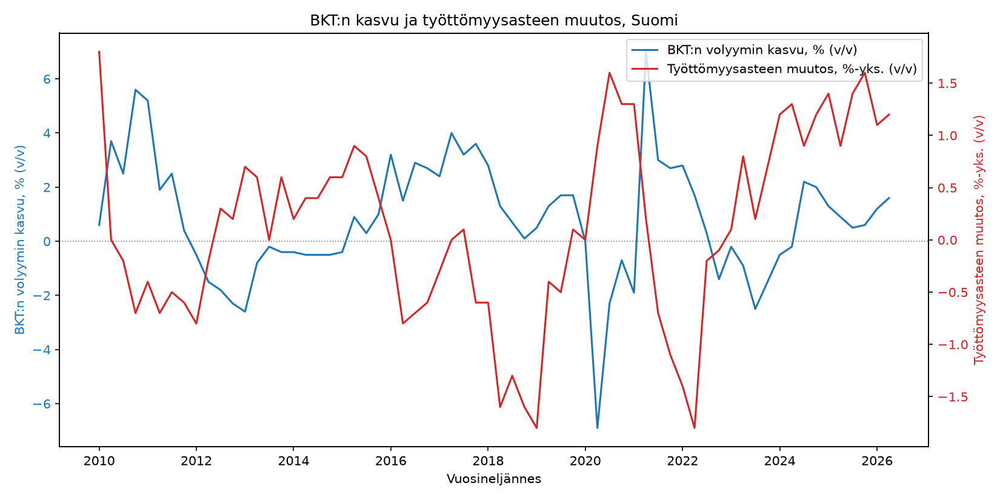
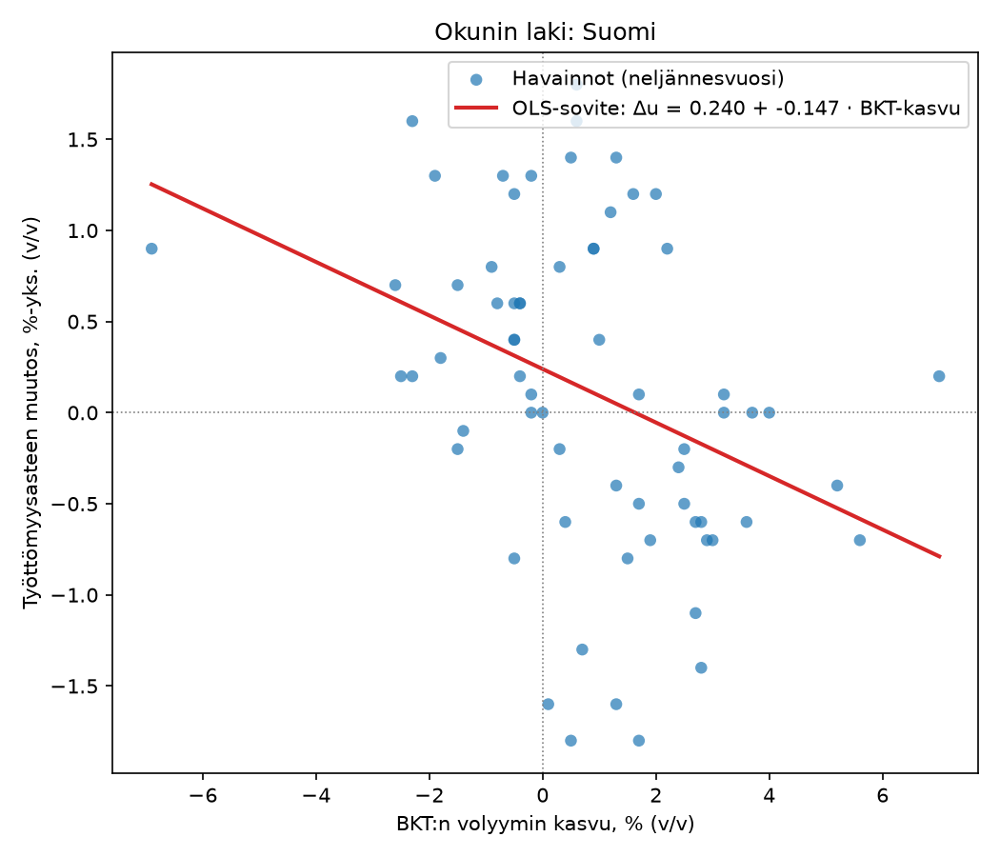

# okun-suomi

Okunin lain estimointi Suomen aineistolla: kuinka BKT:n volyymin kasvu
liittyy työttömyysasteen muutokseen. Data haetaan ajossa suoraan
Tilastokeskuksen [PxWeb-rajapinnasta](https://pxdata.stat.fi/) — mitään
lukuja ei ole kovakoodattu tai simuloitu koodiin.

## Rakenne

```
okun_suomi/
  datahaku.py   # PxWeb-rajapinnasta datan hakeva moduuli (v/v- ja q/q-sarjat)
  analyysi.py   # OLS-regressio, HAC/DW/BG-diagnostiikka, otosvertailut, kuvaajat
  raportti.py   # muotoilee tulosoliot Markdownixi ja kirjoittaa tulokset.md:n
main.py         # ajaa koko putken: haku -> yhdistäminen -> regressio -> robustisuus -> kuvat -> tulokset.md
requirements.txt
kuvat/          # tähän tallentuvat piirretyt kuvat (aikasarjat.png, hajontakuvio.png) — upotettu README:hin alla
tulokset.md     # versionhallittava tuloskooste (kertoimet, kolme keskivirhettä, N/df, testit, kynnyskasvut);
                # ylikirjoittuu joka ajolla, committoidaan git-historiaan ajojen väliseksi diffiksi
```

## Käytetty data

Rajapinnan oikea polku selvitettiin kokeilemalla (`https://pxdata.stat.fi/api/v1/...`
palauttaa 404 — oikea juuri on `https://pxdata.stat.fi/PxWeb/api/v1/fi/...`).

| Sarja | Taulukko | Rajaus | Sisältö |
|---|---|---|---|
| BKT:n volyymin kasvu | `StatFin/ntp/132h.px` | taloustoimi `B1GMH` (BKT markkinahintaan), `vol_vv_tyopvv2015` | Työpäiväkorjatun sarjan volyymin muutos vuodentakaisesta, % |
| Työttömyysaste | `StatFin/tyti/137h.px` | sukupuoli `SSS` (koko väestö), ikäryhmä `15-74` | Työttömyysaste, % |

Molemmat ovat neljännesvuositason, kausivaihtelultaan siistiytyviä
**vuosimuutossarjoja** (verrataan aina samaan neljännekseen vuotta
aiemmin) — tämä poistaa kausivaihtelun ilman erillistä kausitasoitusta ja
mahdollistaa suoraan vertailukelpoisten sarjojen käytön.

### Miksi työttömyysaste alkaa vasta 2009/2010?

BKT-sarja on saatavilla StatFinissä vuodesta 1990 lähtien, mutta
työvoimatutkimus **uudistettiin vuoden 2021 alussa**, ja Tilastokeskus
toteaa StatFin-taulukon 137h metatiedoissa nimenomaisesti, että sen
takautuvasti korjatut sarjat (2009Q1 alkaen) **eivät ole
vertailukelpoisia** vanhemman, arkistoituun StatFin_Passiivi-kantaan
siirretyn taulukon 11c8 (1989Q1–2020Q4) kanssa. Jotta lopullinen aikasarja
olisi tehtävänannon mukaisesti **yhtenäinen**, tässä ei yhdistetä kahta eri
menetelmävintagea, vaan käytetään yksinomaan nykyistä, sisäisesti
johdonmukaista taulukkoa 137h. Tämä rajaa käytettävissä olevan, aidosti
yhtenäisen aineiston noin **2010Q1 alkaen** (vuosimuutos vaatii neljä
edeltävää havaintoa), vaikka BKT-sarja itsessään ulottuisi kauemmas.
Rajapinta ja taulukot voi vaihtaa `okun_suomi/datahaku.py`:ssä, jos pidempi
mutta epäyhtenäinen sarja on tarkoituksenmukaisempi johonkin toiseen
käyttötarkoitukseen.

Jos rajapintaan ei ajohetkellä saada yhteyttä tai vastaus on odottamaton,
`datahaku.py` nostaa selkeän poikkeuksen — se ei koskaan korvaa dataa
keksityllä tai simuloidulla aineistolla.

### Onko taulukossa 137h katkos vuoden 2021 uudistuksen kohdalla?

Ei — **taulukon 137h sisällä ei ole katkosta**. Sekä 137h:n että sen
kuukausivastineen (135z) metatiedoissa Tilastokeskus toteaa suoraan:

> "Työvoimatutkimus on uudistettu vuoden 2021 alussa. Taulukko sisältää
> uuden estimointimenetelmän mukaisiksi **takautuvasti korjatut**
> aikasarjat, jotka eivät ole vertailukelpoisia aiempien vuosien tietojen
> kanssa. Tämä taulukko 137h korvaa taulukon 11c8, joka on siirretty
> arkistokantaan."

Toisin sanoen: koko taulukon 137h julkaistu aikaväli (2009Q1 lähtien)
on laskettu **yhdellä ja samalla**, uuden (2021) menetelmän mukaisella
tavalla — vuoden 2021 kohdalla ei siis ole metodologista hyppyä sarjan
sisällä, koska myös 2009–2020 on korjattu jälkikäteen vastaamaan uutta
menetelmää. Katkos on sen sijaan taulukon **rajalla**: vanhempi,
alkuperäisellä (pre-2021) menetelmällä laskettu sarja on eri taulukossa
(11c8, StatFin_Passiivi, 1989Q1–2020Q4), eikä sitä Tilastokeskuksen oman
ilmoituksen mukaan pidä yhdistää 137h:n kanssa. Juuri tästä syystä tässä
projektissa käytetään yksinomaan taulukkoa 137h eikä yhdistetä sitä
arkistoituun 11c8:aan (ks. yllä "Miksi työttömyysaste alkaa vasta
2009/2010?").

## Malli

Okunin laki estimoidaan muutosten (first-difference) muodossa:

```
Δtyöttömyysaste_t = a + b · BKT_kasvu_t + e_t
```

jossa `Δtyöttömyysaste_t` on työttömyysasteen muutos vuodentakaisesta
(prosenttiyksikköä) ja `BKT_kasvu_t` BKT:n volyymin kasvu vuodentakaisesta
(%). Okunin lain mukaan kerroin `b` on negatiivinen.

## Asennus ja ajo

```bash
python3 -m venv venv
source venv/bin/activate        # Windows: venv\Scripts\activate
pip install -r requirements.txt
python main.py
```

Skripti tulostaa:
1. mitä dataa rajapinnasta haettiin (havaintomäärät, aikaväli, näyte),
2. OLS-regressiotulokset alkuperäiselle spesifikaatiolle (kertoimet,
   keskivirheet, t- ja p-arvot, R², kynnyskasvu),
3. robustisuustarkastelun: OLS/Newey–West/Andrews–Monahan-keskivirheet ja
   autokorrelaatiodiagnostiikka, otosvertailutaulukon, vaihtoehtoisen
   viivemuotoisen neljännesmuutos-spesifikaation, sekä annualisoidun
   kynnyskasvuyhteenvedon (ks. alla "Robustisuustarkastelu"),

ja tallentaa:
- hakemistoon `kuvat/`:
  - `aikasarjat.png` — BKT:n kasvu ja työttömyysasteen muutos samassa
    kuvassa (kaksi y-akselia), upotettuna myös tähän READMEen alla,
  - `hajontakuvio.png` — hajontakuvio BKT-kasvusta ja työttömyysasteen
    muutoksesta OLS-sovitesuoralla, upotettuna myös tähän READMEen alla,
- `tulokset.md` — versionhallittava Markdown-kooste kaikista taulukoista
  (kertoimet, OLS/NW/AM-keskivirheet, N ja vapausasteet, DW/BG- ja
  kausivaihtelutestit, kynnyskasvut), alkuun merkittynä ajon UTC-
  aikaleima ja käytetyn datan viimeinen havainto. Committoi tiedosto
  git-historiaan ajojen välillä, jotta tulosten muutokset (esim.
  Tilastokeskuksen datapäivitysten myötä) näkyvät diffinä.

## Esimerkkitulos

Ajettuna 2026-09-03 aineistolla 2010Q1–2026Q2 (N=66):

```
Termi               Kerroin    Keskivirhe    t-arvo    p-arvo
----------------------------------------------------------------------
Vakio (a)            0.2397        0.1103     2.172    0.0335
BKT-kasvu (b)       -0.1469        0.0471    -3.117    0.0027
----------------------------------------------------------------------
Selitysaste R²:  0.1318
Kynnyskasvu -a/b:    1.632 % (BKT:n kasvuvauhti, jolla työttömyysaste ei muutu)
```

Kerroin on tilastollisesti merkitsevä ja etumerkiltään Okunin lain
mukainen (negatiivinen), mutta selitysaste on matala — Suomen
työttömyysasteen vaihtelusta valtaosa selittyy muilla tekijöillä kuin
pelkällä BKT:n kasvulla. Koska data haetaan rajapinnasta joka ajokerralla,
tarkat luvut päivittyvät Tilastokeskuksen datan päivittyessä.

**BKT:n kasvu ja työttömyysasteen muutos samassa kuvassa:**



**Hajontakuvio ja OLS-sovitesuora:**



Molemmat kuvat päivittyvät joka ajolla (`python main.py`) tuoreimmalla
haetulla datalla — committoi päivittyneet PNG-tiedostot, jos haluat
niiden näkyvän myös reposivulla ajantasaisina.

## Robustisuustarkastelu

Alkuperäistä spesifikaatiota ei ole poistettu — `okun_suomi/analyysi.py`
sisältää edelleen `estimoi_okunin_laki`/`tulosta_tulokset` ennallaan,
ja `main.py` ajaa alla kuvatut tarkastelut sen **rinnalla**.

### 1. Kolme keskivirhevaihtoehtoa: OLS, Newey–West, Andrews–Monahan

Peräkkäiset vuosimuutokset (`u_t - u_{t-4}` neljänneksiltä t ja t-1)
jakavat kolme neljästä termistään, mikä synnyttää mekaanisesti MA(3)-
tyyppisen autokorrelaation jäännöksiin. Tavalliset OLS-keskivirheet eivät
ota tätä huomioon, joten jokaiselle mallille lasketaan **kolme**
vaihtoehtoista keskivirhettä rinnakkain:

- **OLS** — klassinen, ei-robusti.
- **Newey–West (HAC)** — Bartlett-ydin, viiveitä vähintään 4 (nyrkki-
  sääntönä `floor(4·(T/100)^(2/9))`, ks. `estimoi_robusti`).
- **Andrews–Monahan (1992) esivalkaistu HAC** — pisteprosessi `x_t·u_t`
  esivalkaistaan ensin VAR(1)-mallilla, sen jäännösten Newey–West-
  kovarianssi lasketaan, ja tulos "uudelleenvärjätään" AR(1)-rakenteen
  mukaisesti (`(I-A)⁻¹ Ω_v (I-A')⁻¹`). Statsmodels ei tarjoa tätä
  valmiina, joten se on toteutettu manuaalisesti `analyysi.py`:ssä
  (`_andrews_monahan_kovarianssi`) ja validoitu niin, että esivalkaisu-
  askeleen ohittaminen (A=0) toistaa statsmodelsin oman
  `cov_type="HAC"`-tuloksen numeerisesti tarkasti.

Otos on pieni (58–66 havaintoa), ja HAC-tyyppiset estimaattorit ovat
tunnetusti **harhaisia alaspäin pienessä otoksessa** (Andrews 1991) —
molemmat voivat siis aliarvioida todellisen epävarmuuden. Siksi
**päätuloksena käytetään aina sitä kahdesta HAC-vaihtoehdosta (Newey–West
tai Andrews–Monahan), joka antaa suuremman (konservatiivisemman)
keskivirheen** BKT-kasvun kokonaisvaikutukselle — ei koskaan pienintä
saatavilla olevaa lukua. Kumpi valitaan, vaihtelee mallista toiseen ja
raportoidaan joka kerta näkyvästi.

```
Termi              Kerroin     OLS-SE      NW-SE      AM-SE
const               0.2397     0.1103     0.1817     0.2830
bkt_kasvu          -0.1469     0.0471     0.0222     0.0270
--------------------------------------------------------------
Päätulokseksi valittu (konservatiivisin): Andrews–Monahan (esivalk.)
Durbin–Watson:              0.466  (<2 → positiivinen autokorrelaatio)
Breusch–Godfrey (L=4):   LM=39.130, p=0.0000
Kynnyskasvu -a/Σb:          1.632 % / vuosi
```

Durbin–Watson (0.47) ja Breusch–Godfrey (p≈0) vahvistavat odotetun,
voimakkaan positiivisen autokorrelaation — päällekkäiset vuosimuutokset
eivät siis ole tilastollisesti harmittomia. Tässä mallissa
Andrews–Monahan (0.0270) on suurempi kuin Newey–West (0.0222) BKT-
kertoimelle, joten se valitaan päätulokseksi; vakiotermille molemmat
HAC-vaihtoehdot ovat suurempia kuin OLS, kuten positiivisen
autokorrelaation vallitessa on odotettavaa.

### 2. Otosvertailu: koko aineisto / ilman 2020–2021 / covid-dummy

Sama v/v-spesifikaatio kolmella otoksella, keskivirheet kunkin mallin
konservatiivisimman HAC-vaihtoehdon mukaisia:

```
Malli                                 Vakio a   BKT-kerroin b   Covid-dummy      R²     N   -a/b, %/v
------------------------------------------------------------------------------------------------------
Koko aineisto (v/v)             0.240 (0.283)  -0.147 (0.027)             –  0.1318    66       1.632
Ilman 2020–2021                 0.206 (0.296)  -0.143 (0.040)             –  0.0881    58       1.445
Covid-dummy mukana              0.206 (0.313)  -0.142 (0.029) 0.248 (0.423)  0.1400    66       1.446
```

Johtopäätös: koronavuodet eivät ajaa tulosta. BKT-kerroin pysyy lähes
muuttumattomana (-0.147 → -0.143/-0.142) riippumatta siitä, poistetaanko
2020–2021 kokonaan vai kontrolloidaanko niiden vaikutus dummy-muuttujalla,
ja pysyy tilastollisesti merkitsevänä myös konservatiivisimmilla
keskivirheillä. Covid-dummyn oma kerroin (0.248) ei ole tilastollisesti
merkitsevä (SE 0.423) — koronashokki näkyy siis pääasiassa suurina BKT-
ja työttömyysheilahteluina, ei systemaattisena tasosiirtymänä sen
jälkeen, kun BKT:n vaikutus on jo kontrolloitu.

### 3. Vaihtoehtoinen spesifikaatio: neljännesmuutokset viiveillä (q/q)

Vuosimuutosten sijaan malli estimoidaan myös kausitasoitetuilla
**neljännesmuutoksilla**, ja BKT-kasvu sisällytetään **viiveillä 0–4
neljännestä** (jakautunut viivemalli, distributed lag):

```
Δtyöttömyysaste_t = a + Σ_{i=0}^{4} b_i · BKT_kasvu_{t-i} + e_t
```

BKT: kausitasoitettu volyymin muutos edellisneljänneksestä
(`StatFin/ntp/132h.px`, sisältökoodi `vol_kk_kausitvv2015`). Työttömyys:
kausitasoitettu työttömyysaste on saatavilla vain kuukausitasolla
(`StatFin/tyti/135z.px`, "kausitasoitettu sarja"), joten se aggregoidaan
neljännesvuosikeskiarvoiksi ennen erotuksen laskemista. BKT:n viiveet
lasketaan täydestä, vuodesta 1990 alkavasta sarjasta, joten viiveiden
lisääminen ei lyhennä otosta — se pysyy samana 65 neljänneksenä kuin
pelkällä kontemporaanisella kertoimella.

**Kausitasoituksen varmistus PxWeb-metatiedoista.** Koska molemmat
q/q-sarjat ovat oleellisia sille, ettei jäljelle jää kausivaihtelua,
`main.py` hakee ajonaikaisesti (`datahaku.varmista_qoq_kausitasoitus`,
GET-pyyntö taulukon metatietoihin — ei pelkkä oletus koodin nimen
perusteella) kummankin sisältökoodin virallisen PxWeb-selitetekstin ja
tarkistaa, että sana "kausitasoi-" esiintyy siinä; muussa tapauksessa
ajo keskeytyy virheeseen. Molemmat vahvistuivat:

| Muuttuja | Taulukko | Sisältökoodi | PxWeb-selite |
|---|---|---|---|
| BKT:n q/q-kasvu | `StatFin/ntp/132h.px` | `vol_kk_kausitvv2015` | "Kausitasoitetun ja työpäiväkorjatun sarjan volyymin muutos edellisneljänneksestä, %" |
| Työttömyysasteen taso (josta q/q lasketaan) | `StatFin/tyti/135z.px` | `Tyottaste_kausi` | "Työttömyysaste, %, kausitasoitettu sarja" |

```
Termi              Kerroin     OLS-SE      NW-SE      AM-SE
const               0.1066     0.0474     0.0451     0.0415
bkt_kasvu_qoq_L0    -0.1100     0.0359     0.0322     0.0312
bkt_kasvu_qoq_L1    -0.0905     0.0367     0.0353     0.0381
bkt_kasvu_qoq_L2    -0.0747     0.0362     0.0244     0.0243
bkt_kasvu_qoq_L3    -0.0222     0.0367     0.0217     0.0218
bkt_kasvu_qoq_L4    -0.0805     0.0357     0.0240     0.0225
--------------------------------------------------------------
N = 65   selittäjiä vakio mukaan lukien k = 6   vapausasteet (df_resid = N-k) = 59
Päätulokseksi valittu (konservatiivisin): Andrews–Monahan (esivalk.)
Durbin–Watson:              2.115  (≈2 → ei havaittavaa autokorrelaatiota)
Breusch–Godfrey (L=3):   LM=3.999, p=0.2616
BKT-kasvun pitkän aikavälin vaikutus (Σb, 5 viivettä, AM-SE):
  Σb = -0.3779  SE = 0.0787  t = -4.803  p = 0.0000
Viiveiden yhteismerkitsevyys (Wald F, H0: kaikki BKT-viiveiden kertoimet = 0):
  F(5,59) = 9.762, p = 0.0000
Kynnyskasvu -a/Σb:          0.282 % / neljännes → annualisoituna 1.133 % / vuosi
```

Durbin–Watson (2.12) ja Breusch–Godfrey (p=0.26) osoittavat, ettei
jäännöksissä ole enää merkittävää autokorrelaatiota — tämä vahvistaa,
että v/v-spesifikaation voimakas autokorrelaatio (DW=0.47) johtuu
nimenomaan vuosimuutosten päällekkäisyydestä eikä esimerkiksi
puuttuvista selittäjistä tai virheellisestä dynamiikasta. Viiveiden
**yhteismerkitsevyys** on erittäin vahva (F(5,59)=9.8, p<0.0001): BKT-
kasvu 0–4 neljänneksen viiveellä selittää työttömyysasteen muutosta
selvästi, vaikka yksittäiset viivekertoimet eivät kaikki erikseen ole
tilastollisesti merkitseviä (esim. L3). Siksi **pitkän aikavälin
vaikutuksena ja kynnyskasvun laskentaperusteena käytetään kertoimien
summaa (Σb = -0.378), ei pelkkää kontemporaanista kerrointa (b₀ = -0.110)**
— pelkkä kontemporaaninen kerroin aliarvioisi BKT-shokin
kokonaisvaikutuksen, koska suuri osa siitä realisoituu vasta
myöhemmillä neljänneksillä.

**Jäännösten kausivaihtelutesti.** Viivekerroin L4 (-0.081) on selvästi
suurempi itseisarvoltaan kuin L3 (-0.022), mikä herättää epäilyn
jäljellä olevasta kausivaihtelusta siitä huolimatta, että molemmat
syöttösarjat on todettu kausitasoitetuiksi (ks. yllä). Tätä testataan
suoraan `analyysi.testaa_jaannosten_kausivaihtelu`-funktiolla: viivemallin
OLS-jäännökset regressoidaan neljännesdummyilla (Q2, Q3, Q4; Q1
referenssinä), ja dummyjen yhteismerkitsevyys testataan F-testillä:

```
Termi           Kerroin         SE        t        p
const           -0.0049     0.0851   -0.058   0.9541
Q_2             -0.0280     0.1185   -0.237   0.8137
Q_3              0.0715     0.1203    0.594   0.5546
Q_4             -0.0217     0.1203   -0.181   0.8573
Yhteismerkitsevyys (F-testi, H0: ei kausivaihtelua jäännöksissä):
F(3,61) = 0.291, p = 0.8316
```

**Tulos: ei tilastollista näyttöä jäljellä olevasta kausivaihtelusta**
jäännöksissä (p=0.83, kaukana merkitsevyysrajoista millään tavanomaisella
tasolla) — kausitasoitus toimii odotetusti, eikä L4-kertoimen suuruus
selity kausiluonteisella jäännösvaihtelulla. Todennäköisempi selitys on
tavallinen otantavaihtelu/multikollineaarisuus viereisten viivetermien
välillä 5-viivemallissa, jossa on vain 65 havaintoa ja 6 selittäjää
(df_resid=59) — peräkkäiset BKT-kasvun viiveet korreloivat keskenään
(BKT-kasvu on itsessään persistentti sarja), mikä voi tehdä
yksittäisistä viivekertoimista epävakaita, vaikka niiden summa (Σb) on
sekä tarkasti että tilastollisesti erittäin merkitsevästi estimoitu.
Yksittäisiä viivekertoimia ei siksi pidäkään tulkita erikseen — juuri
tästä syystä kohdassa 3 pitkän aikavälin vaikutuksena käytetään
kertoimien summaa, ei yksittäisiä viivekertoimia.

### 4. Kynnyskasvu (-a/Σb) kaikissa spesifikaatioissa, annualisoituna

Jotta v/v- ja q/q-spesifikaatiot ovat suoraan vertailukelpoisia, kaikki
kynnyskasvut on annualisoitu (%/vuosi). V/v-mallit ovat jo valmiiksi
vuositasoisia sellaisenaan; q/q-mallin neljänneskohtainen kynnys
annualisoidaan korkoa korolle -periaatteella,
`g_vuosi = (1 + g_neljännes/100)^4 - 1` (BKT kasvaisi samalla vauhdilla
joka neljännes tasapainossa) — **ei** kertomalla neljällä, koska
kasvuprosentit eivät summaudu suoraan yli useamman jakson.

| Spesifikaatio | Yksikkö | Kynnyskasvu omassa yksikössä | Annualisoitu, %/vuosi |
|---|---|---|---|
| Alkuperäinen (v/v, OLS, ei-robusti) | v/v | 1.632 %/v | 1.632 |
| Koko aineisto (v/v, konservatiivinen HAC) | v/v | 1.632 %/v | 1.632 |
| Ilman 2020–2021 (v/v, konservatiivinen HAC) | v/v | 1.445 %/v | 1.445 |
| Covid-dummy, ei-covid-tila (v/v, konservatiivinen HAC) | v/v | 1.446 %/v | 1.446 |
| Neljännesmuutokset, Σb viiveille 0–4 (q/q, konservatiivinen HAC) | q/q | 0.282 %/neljännes | **1.133** |

V/v-spesifikaatioiden kynnyskasvu (~1.4–1.6 %/v) ja q/q-spesifikaation
Σb-pohjainen, annualisoitu kynnyskasvu (~1.1 %/v) ovat nyt samaa
suuruusluokkaa ja molemmat lähellä Suomen pitkän aikavälin
trendikasvua — toisin kuin aiemmassa versiossa, jossa q/q-mallin pelkkään
kontemporaaniseen kertoimeen perustuva, ei-annualisoitu kynnys (0.53 %)
näytti harhaanjohtavan paljon pienemmältä kuin v/v-luvut, vaikka kyse oli
vain yksikkö- ja spesifikaatioerosta eikä todellisesta ristiriidasta.
Lukuja ei silti pidä tulkita tarkkoina ennusteina — kyse on pistesuureista
epälineaarisen muunnoksen (annualisoinnin) läpi, eikä niille ole
laskettu erillistä epävarmuusväliä.

**Huom:** koska data haetaan rajapinnasta joka ajokerralla ja
Tilastokeskus päivittää sekä uusimpia neljänneksiä että joskus
takautuvia tarkistuksia, tässä esitetyt luvut (ajettu 2026-09-03) voivat
poiketa hieman siitä, mitä `python main.py` tulostaa myöhemmin ajettuna.
